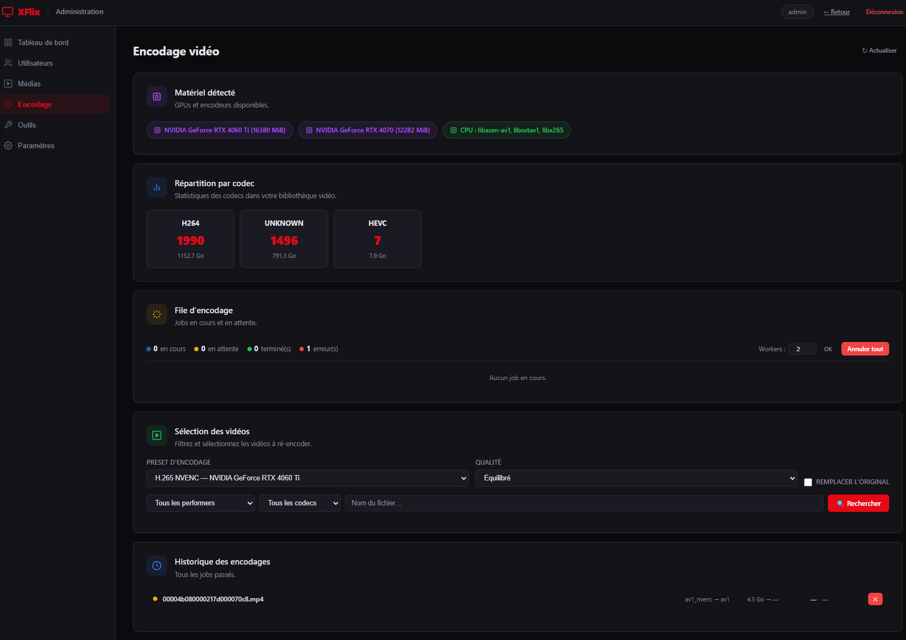
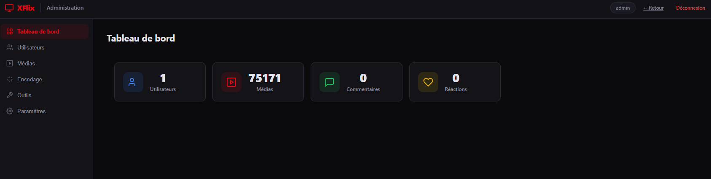

# XFlix

**Self-hosted Netflix-like media browser** for local video and photo collections.

Node.js · Express · MariaDB · Vanilla JS frontend (zero build step)

---

## Table of contents

1. [Features](#features)
2. [Architecture overview](#architecture-overview)
3. [Requirements](#requirements)
4. [Quick install](#quick-install)
5. [Manual install](#manual-install)
6. [Configuration reference](#configuration-reference)
7. [Directory layout](#directory-layout)
8. [How the scanner works](#how-the-scanner-works)
9. [Thumbnail system](#thumbnail-system)
10. [Encoding](#encoding)
11. [API reference](#api-reference)
12. [Admin panel](#admin-panel)
13. [Keyboard shortcuts](#keyboard-shortcuts)
14. [Troubleshooting](#troubleshooting)
15. [Contributing](#contributing)
16. [License](#license)

---

## Features

### Browsing & playback

- Browse **performers** (one subdirectory = one performer) and their media
- **Video streaming** with HTTP Range requests — instant seek, pause/resume
- **Photo lightbox** with full-screen view and keyboard navigation
- **Discover** page with random videos + photos
- Global **search** with advanced filters (size, duration, type, favourite…)

### Accounts & social

- **Register / Login** via JWT (7-day expiry by default, configurable)
- Roles: `admin` / `member` — first registered user is automatically admin
- Per-media **comments** and **reactions** (like / dislike)
- **Personal favourites** (per-user) and **global favourites** (admin-set)
- Password reset by email (SMTP) or direct link logged server-side (dev fallback)

### Admin panel

- **Scan** with live SSE progress stream
- Auto-enrich **video durations** (ffprobe) + auto-generate **thumbnails** post-scan
- **Duplicate detection** using partial MD5 hash (first 64 KB) + bulk delete
- **Clean media**: find orphaned DB rows, unindexed files, orphaned thumbnails
- **Purge short videos**: delete all videos under a configurable duration threshold
- **Media browser**: filter and delete by performer / type / filename
- **Batch thumbnail** generation with live progress
- **User management**: change role, delete account
- **SMTP settings** editable at runtime (no restart needed)
- **Encoding** subsystem: re-encode to H.265 / AV1 with hardware or CPU

---

## Changelog

### v2.1 (current)

- **Rate limiter fix**: `authLimiter` is now scoped to `POST /login`, `/register`,
  `/forgot-password`, `/reset-password` only. Previously it was mounted on the entire
  `/auth` router, causing `/config` and `/me` (called on every page load) to hit the
  30-req limit and return *"Too many requests"* in a loop.
- **Password reset URL**: the reset link is now derived from the incoming request
  (`req.protocol + req.get('host')`), so it correctly reflects the real domain / port /
  HTTPS regardless of reverse-proxy setup. Set `BASE_URL` in `.env` to override.
- **SMTP overhaul** (`services/mail.js`):
  - `tls.rejectUnauthorized` is always `false` — compatible with self-signed certs and
    most providers.
  - `auth` is conditionally omitted when credentials are empty — fixes
    *"Missing credentials for PLAIN"* in nodemailer v8.
  - `requireTLS: true` (STARTTLS) applied when not in direct-SSL mode.
  - Connection / socket timeouts (10 s / 20 s).
  - Single DB call: `createTransport()` returns `{ transport, settings }`.
- **Admin settings** (`routes/admin.js`): saving SMTP settings no longer overwrites
  `smtp_pass` when the field is blank or contains the masked placeholder.
- **Admin UI** (`public/js/admin.js`): SMTP password field uses a placeholder instead
  of a pre-filled masked value — prevents accidental blank overwrites on save.

### v2.0

- New video re-encoding subsystem: encode to H.265 (HEVC) or AV1 via Admin → Encodage.
- Automatic hardware detection (NVIDIA NVENC, Intel QSV, VA-API) with CPU fallback.
- Worker pool + queue management for multi-GPU / concurrent encodes.
- Real-time progress (SSE) and job history with cancel / retry / delete.
- Admin UI completely redesigned (modern dark theme, frosted navbar, Encodage tab).

### v1.2

- Auto-tagging on scan: resolution (4K / 1080p / 720p / SD), codec (H.265 / VP9 / AV1),
  duration buckets.
- Dark / light theme toggle persisted in `localStorage`.
- Tag-based filtering on performer pages.
- "Nouveautés" (Recently added) page and Discover section.
- Related videos in the player (same performer random sample).
- Custom thumbnail upload: `POST /api/thumb/:id/upload`.
- Infinite scroll on performer video lists.
- Video technical info (codec, fps, bitrate, audio) via `ffprobe`.

---

## Architecture overview

```
Browser (Vanilla JS SPA)
    │  REST + SSE  │  Range streaming
    ▼              ▼
┌────────────────────────────────────────────┐
│              Express (server.js)           │
│  /auth   /social   /admin   /api   /stream │
└──────────┬─────────────────────────────────┘
           │ mysql2/promise pool (20 connections)
           ▼
      MariaDB (xflix DB)
      ┌──────────────────┐
      │ performers        │ ◄── one row per MEDIA_DIR subdirectory
      │ media             │ ◄── one row per video / photo file
      │ users             │
      │ comments          │
      │ media_reactions   │
      │ user_favorites    │
      │ settings          │ ◄── SMTP + app config (key/value)
      │ encode_jobs       │ ◄── encoding queue + history
      └──────────────────┘
```

Background jobs (fire-and-forget, after scan):

```
enrichDurations()        ← ffprobe, concurrency 3
generateMissingThumbs()  ← ffmpeg/sharp, concurrency 3
```

**File map:**

```
xflix/
├── server.js           Entry point — Express, routes, DB init with retry
├── db.js               mysql2 pool, schema migrations, all DB helpers
├── scanner.js          File walker, batch insert, thumb generation
├── cli.js              CLI: node cli.js scan | clear
│
├── routes/
│   ├── api.js          Public REST API (performers, media, search, stats…)
│   ├── auth.js         Register, login, JWT, password reset
│   ├── social.js       Comments, reactions, per-user favourites
│   ├── admin.js        Scan, users, settings, duplicates, clean, encoding
│   └── stream.js       Video range streaming, photos, thumbnails, downloads
│
├── middleware/
│   └── auth.js         JWT middleware: optionalAuth, requireAuth, requireAdmin
│
├── services/
│   └── mail.js         Nodemailer transactional email (password reset)
│
├── public/             Static frontend (served as-is by Express)
│   ├── index.html      SPA shell
│   ├── admin.html      Admin panel shell
│   ├── css/
│   │   ├── style.css
│   │   └── admin.css
│   └── js/
│       ├── app.js      Entire SPA logic (~1 800 lines, no framework)
│       └── admin.js    Admin panel logic
│
├── data/
│   └── thumbs/         Generated JPEG thumbnails (git-ignored, .gitkeep inside)
│
├── .env.example        All supported environment variables with documentation
├── .admin-creds        Admin credentials written by install.sh (chmod 600, git-ignored)
├── install.sh          One-shot install + PM2 launcher
└── package.json
```

---

## Requirements

| Component | Minimum | Notes |
|---|---|---|
| Linux | Ubuntu 20.04+ / Debian 11+ | Other distros work if you install deps manually |
| Node.js | 18.x | Installed automatically by `install.sh` via nvm |
| MariaDB | 10.5+ | MySQL 8.0+ also works |
| FFmpeg | any recent | Required for video thumbnails and duration extraction — installed by `install.sh` |
| sharp (npm) | — | Image processing for photo thumbnails; installed via `npm install` |
| ffprobe | bundled with FFmpeg | Extracts codec / fps / bitrate / audio info |
| RAM | 512 MB+ | More RAM = larger DB buffer pool |
| Disk | — | `data/thumbs/` grows ~10 KB per media item |

---

## Quick install

```bash
git clone https://github.com/HeartBtz/Xflix.git
cd Xflix
bash install.sh
```

`install.sh` does everything in one shot:

1. Installs **nvm** + **Node.js 20** if absent
2. Installs and starts **MariaDB** if absent
3. Installs **FFmpeg** if absent
4. Creates the `xflix` database and MariaDB user with a **random password**
5. Runs `npm install`
6. Generates `.env` with a strong random `JWT_SECRET` and `DB_PASS` (if absent)
7. Creates the default admin account if no users exist
8. Writes credentials to **`.admin-creds`** (chmod 600)
9. Starts the server via **PM2** and registers it for boot autostart

After install:

```bash
cat .admin-creds      # read your admin email + password
```

Then open **http://localhost:3000**, log in, and launch a scan from ⚙️ Admin.

> **To update:** `git pull && bash install.sh`

---

## Purging data (fresh start)

```bash
node cli.js clear                             # truncate DB, rebuild schema
rm -f data/thumbs/* && touch data/thumbs/.gitkeep   # clear thumbnails
node cli.js scan                              # re-index
```

---

## Manual install

### 1. System dependencies

```bash
sudo apt update
sudo apt install -y mariadb-server ffmpeg build-essential
sudo systemctl enable --now mariadb
```

### 2. MariaDB database

```bash
sudo mariadb -u root << 'SQL'
CREATE DATABASE IF NOT EXISTS xflix CHARACTER SET utf8mb4 COLLATE utf8mb4_unicode_ci;
CREATE USER IF NOT EXISTS 'xflix'@'localhost' IDENTIFIED BY 'change_me';
GRANT ALL PRIVILEGES ON xflix.* TO 'xflix'@'localhost';
FLUSH PRIVILEGES;
SQL
```

> Replace `change_me` with a strong password and set `DB_PASS` in `.env`.

### 3. Node.js via nvm

```bash
curl -fsSL https://raw.githubusercontent.com/nvm-sh/nvm/v0.39.7/install.sh | bash
source ~/.bashrc
nvm install 20
nvm alias default 20
```

### 4. Clone and configure

```bash
git clone https://github.com/HeartBtz/Xflix.git
cd Xflix
npm install
cp .env.example .env
nano .env    # set MEDIA_DIR, DB_PASS, JWT_SECRET at minimum
```

### 5. Run

```bash
# Development (logs to stdout)
node server.js

# Production (PM2 — restarts on crash, survives reboots)
npm install -g pm2
pm2 start server.js --name xflix
pm2 save
pm2 startup   # follow the printed instructions
```

### 6. Scan your media

```bash
node cli.js scan
# Or: Admin → Scan → ▶ Lancer un scan
```

---

## Configuration reference

Copy `.env.example` to `.env`. All fields are optional except those marked **required**.

| Variable | Default | Description |
|---|---|---|
| `PORT` | `3000` | HTTP port |
| `MEDIA_DIR` | `/home/coder/OF` | **Required.** Absolute path to your media root. Each immediate subdirectory becomes a performer. |
| `THUMB_DIR` | `<repo>/data/thumbs` | Where thumbnails are stored. |
| `ENCODE_DIR` | `<repo>/data/encoded` | Where encoded videos are stored. |
| `DB_HOST` | `localhost` | MariaDB host |
| `DB_PORT` | `3306` | MariaDB port |
| `DB_USER` | `xflix` | MariaDB user |
| `DB_PASS` | `changeme` | **Change in production.** MariaDB password. |
| `DB_NAME` | `xflix` | Database name |
| `JWT_SECRET` | *(weak default)* | **Change in production.** Generate: `node -e "console.log(require('crypto').randomBytes(64).toString('hex'))"` |
| `JWT_EXPIRES` | `7d` | Token validity (e.g. `1h`, `30d`) |
| `BASE_URL` | *(auto-derived)* | Base URL for password-reset emails. Auto-derived from request host — only override if your reverse proxy changes the `Host` header. Example: `https://xflix.example.com` |
| `CORS_ORIGIN` | *(reflect origin)* | Allowed CORS origins. Leave unset for same-origin / proxy setups. |
| `SMTP_HOST` | — | SMTP server hostname |
| `SMTP_PORT` | `587` | `587` = STARTTLS, `465` = SSL |
| `SMTP_USER` | — | SMTP username |
| `SMTP_PASS` | — | SMTP password |
| `SMTP_FROM` | — | Sender address (e.g. `XFlix <no-reply@example.com>`) |
| `SMTP_SECURE` | `false` | `true` for direct SSL (port 465) |

> SMTP can also be configured at runtime from **Admin → Paramètres** without restarting.
> Values are stored in the `settings` DB table and take effect immediately.

---

## Directory layout

XFlix expects your media in a flat two-level structure:

```
MEDIA_DIR/
├── PerformerName/
│   ├── video1.mp4
│   ├── photo1.jpg
│   └── nested/
│       ├── video2.mkv
│       └── photo2.png
└── AnotherPerformer/
    └── …
```

- Each **immediate subdirectory** of `MEDIA_DIR` becomes one `performers` row.
- Media can be **nested at any depth** inside the performer directory.
- Supported video: `.mp4 .mkv .avi .mov .webm .wmv .flv .m4v .ts .3gp`
- Supported photos: `.jpg .jpeg .png .gif .webp .bmp .heic .heif .avif`

---

## How the scanner works

```
Admin → Scan
   │
   ├─ 1. Read all performer subdirectories from MEDIA_DIR
   ├─ 2. Load ALL existing file paths into memory (one query)
   ├─ 3. For each performer:
   │      a. Upsert the performers row
   │      b. Async-walk the directory tree (async generator, non-blocking)
   │      c. Skip already-indexed files (in-memory Set lookup, O(1))
   │      d. stat() new files, accumulate into 500-row batches
   │      e. INSERT IGNORE batch into media table
   │      f. Send SSE progress event after each batch
   ├─ 4. UPDATE performer counts (video_count, photo_count, total_size)
   ├─ 5. Refresh random_cover_id for each performer
   │
   └─ Background (fire-and-forget):
          enrichDurations(3)        → ffprobe each video without duration
          generateMissingThumbs()   → ffmpeg/sharp for recent media without thumb
```

Scan is **incremental**: already-indexed files are skipped. Running again after adding files is safe and fast.

---

## Thumbnail system

Thumbnails are stored in `data/thumbs/`:
- Videos → `v_<media_id>.jpg`
- Photos → `p_<media_id>.jpg`

**On-demand generation** (`GET /thumb/:id`):

1. If `thumb_path` is set in DB and the file exists → serve immediately (7-day cache).
2. Otherwise, attempt generation: sharp (photos) or ffmpeg at 10% mark (videos).
3. A **semaphore** limits concurrent generation to 3.
4. If the queue is full → `503 Retry-After: 4` to keep browser connections free.
5. The frontend retries up to 4 times with exponential back-off (2 s, 4 s, 6 s, 8 s)
   before falling back to a lazy `<video>` element.

**Batch generation** runs automatically after every scan (last 300 media, concurrency 3).
Trigger manually from **Admin → Générer les miniatures**.

---

## Encoding

XFlix includes a re-encoding subsystem accessible from Admin → Encodage.

- Target codecs: **H.265 (HEVC)** and **AV1**
- Backends: NVIDIA NVENC, Intel QSV, VA-API (AMD/Intel), CPU (`libx265`, `libsvtav1`, `libaom-av1`)
- Real-time progress via SSE, job queue, cancel / retry / delete, optional replacement of originals

**API endpoints** (admin JWT required):

| Method | Path | Description |
|---|---|---|
| GET | `/admin/encode/capabilities` | Hardware detection + available presets |
| GET | `/admin/encode/status` | Current queue status |
| GET | `/admin/encode/history` | Paginated job history |
| POST | `/admin/encode/enqueue` | Enqueue media IDs |
| POST | `/admin/encode/cancel/:id` | Cancel a job |
| POST | `/admin/encode/cancel-all` | Cancel all jobs |
| POST | `/admin/encode/retry/:id` | Retry a failed job |
| DELETE | `/admin/encode/job/:id` | Delete job record |
| POST | `/admin/encode/workers` | Set max worker count |
| GET | `/admin/encode/videos` | Searchable video list |
| GET | `/admin/encode/codec-stats` | Counts + sizes by codec |
| GET | `/admin/encode/events` | SSE stream for real-time progress |

**Requirements:** FFmpeg 6+ with desired encoders compiled in. NVENC needs NVIDIA drivers. VA-API needs `/dev/dri`. CPU encoders always available as fallback.

**Quick curl examples:**

```bash
# Authenticate
curl -X POST http://localhost:3000/auth/login \
  -H 'Content-Type: application/json' \
  -d '{"email":"admin@xflix.local","password":"<from .admin-creds>"}'
# → { "token": "ey..." }
export TOKEN="ey..."

# Hardware capabilities
curl -H "Authorization: Bearer $TOKEN" http://localhost:3000/admin/encode/capabilities

# List videos (filter by codec)
curl -H "Authorization: Bearer $TOKEN" \
  "http://localhost:3000/admin/encode/videos?limit=20&codec=h264"

# Enqueue
curl -X POST -H "Authorization: Bearer $TOKEN" -H 'Content-Type: application/json' \
  http://localhost:3000/admin/encode/enqueue \
  -d '{"mediaIds":[12,45,67],"presetId":"cpu_h265","quality":"balanced","replaceOriginal":false}'

# Real-time SSE progress
curl -N -H "Authorization: Bearer $TOKEN" http://localhost:3000/admin/encode/events
```

### Screenshots




---

## Performance

| Technique | Effect |
|---|---|
| DB indexes on `last_viewed`, `(performer_id, type)`, `(type, favorite)`, `(type, view_count)` | Fast sort / filter queries |
| `random_cover_id` stored per performer | No `ORDER BY RAND()` on every page load |
| Async walker (async generator) | 60 000+ files scanned without blocking the event loop |
| Batch insert (500 rows / query) | ~10× faster than individual INSERTs |
| Selective gzip (JSON / HTML / CSS / JS only) | No double-compressing video or images |
| Thumb semaphore (max 3 concurrent) | Prevents FFmpeg flood when a performer loads |
| Rate limiter on brute-force routes only | `/config` and `/me` never blocked by auth limiter |

---

## API reference

All endpoints return JSON. Errors always include `{ "error": "..." }`.

### Performers

| Method | Path | Description |
|---|---|---|
| GET | `/api/performers` | List. Query: `q`, `sort`, `order`, `favorite`, `minVideos`, `minPhotos`, `limit`, `offset` |
| GET | `/api/performers/:name` | Single performer by name |
| POST | `/api/performers/:id/favorite` | Toggle global favourite |

### Media

| Method | Path | Description |
|---|---|---|
| GET | `/api/performers/:name/videos` | Paginated videos. Query: `sort`, `order`, `page`, `limit`, `minSize`, `maxSize`, `minDuration`, `maxDuration`, `favorite` |
| GET | `/api/performers/:name/photos` | Paginated photos |
| GET | `/api/media/:id` | Single record + performer name |
| POST | `/api/media/:id/favorite` | Toggle global favourite |
| POST | `/api/media/:id/view` | Increment view counter |

### Discovery

| Method | Path | Description |
|---|---|---|
| GET | `/api/search` | Search across filename and performer name |
| GET | `/api/random/videos` | Random video sample (`limit` max 100) |
| GET | `/api/random/photos` | Random photo sample |
| GET | `/api/random/performer` | Random performer |
| GET | `/api/recent` | Recently viewed |
| GET | `/api/popular` | Most viewed |
| GET | `/api/favorites` | Globally favourited media |
| GET | `/api/stats` | Aggregate dashboard stats |

### Streaming

| Method | Path | Description |
|---|---|---|
| GET | `/stream/:id` | Video stream (`206 Partial Content`, Range support) |
| GET | `/photo/:id` | Full-size photo |
| GET | `/thumb/:id` | Thumbnail (generated on first request) |
| GET | `/download/:id` | Force-download with original filename |

### Authentication

| Method | Path | Rate limited | Description |
|---|---|---|---|
| POST | `/auth/register` | ✓ | Create account |
| POST | `/auth/login` | ✓ | Returns JWT |
| GET | `/auth/me` | — | Current user profile (requires auth) |
| PUT | `/auth/profile` | — | Update username / bio (requires auth) |
| POST | `/auth/change-password` | — | Change password (requires auth) |
| POST | `/auth/forgot-password` | ✓ | Send reset email |
| POST | `/auth/reset-password` | ✓ | Consume reset token |
| GET | `/auth/config` | — | Is registration open? |

### Social (all require auth except GETs)

| Method | Path | Description |
|---|---|---|
| GET | `/social/comments/:mediaId` | Paginated comments |
| POST | `/social/comments/:mediaId` | Post a comment |
| PATCH | `/social/comments/:id` | Edit own comment |
| DELETE | `/social/comments/:id` | Delete own comment |
| GET | `/social/reactions/:mediaId` | Like/dislike counts |
| POST | `/social/reactions/:mediaId` | Add / toggle reaction |
| GET/POST | `/social/favorites/:mediaId` | Check / toggle personal favourite |
| GET | `/social/favorites` | User's personal favourites |

### Admin (all require `role=admin`)

| Method | Path | Notes |
|---|---|---|
| GET | `/admin/stats` | Dashboard counts |
| GET / PATCH / DELETE | `/admin/users/*` | User management |
| GET / PUT | `/admin/settings` | App settings (SMTP…) |
| POST | `/admin/settings/test-smtp` | Test SMTP connectivity |
| POST | `/admin/scan` | **SSE** — scan with live progress |
| POST | `/admin/scan/cancel` | Cancel in-progress scan |
| POST | `/admin/batch-thumbs` | **SSE** — batch thumbnail generation |
| GET | `/admin/media` | Media browser |
| DELETE | `/admin/media/:id` | Delete record (+ optional disk) |
| POST | `/admin/duplicates/scan` | **SSE** — hash-based duplicate detection |
| POST | `/admin/duplicates/delete-bulk` | **SSE** — bulk delete duplicates |
| DELETE | `/admin/duplicates/:id` | Delete one duplicate |
| POST | `/admin/clean-media` | **SSE** — orphan / unindexed scan |
| POST | `/admin/purge-short-videos` | **SSE** — delete short videos |
| GET/POST/DELETE | `/admin/encode/*` | See [Encoding](#encoding) |

> **SSE endpoints** stream `data: {...}\n\n` events. The last event always carries `status: "done"` or `status: "error"`.

---

## Admin panel

Access via the ⚙️ icon (visible only when logged in as admin).

| Tab | What it does |
|---|---|
| **Scan** | Index new media files. Progress shown live via SSE. |
| **Miniatures** | Generate thumbnails for media without one. |
| **Encodage** | Re-encode videos to H.265 / AV1 with hardware or CPU backends. |
| **Doublons** | Detect duplicate files using fast partial hashing. |
| **Nettoyage** | Find orphaned DB records, unindexed disk files, stale thumbs. |
| **Purge** | Delete videos shorter than a configurable duration. |
| **Médias** | Browse, search and delete individual media records. |
| **Utilisateurs** | Manage user accounts and roles. |
| **Paramètres** | Configure SMTP, toggle open registration. |

---

## Keyboard shortcuts

| Key | Action |
|---|---|
| `←` / `→` | Previous / next in lightbox or video player |
| `F` | Toggle favourite on current media |
| `D` | Download current media |
| `Escape` | Close lightbox / player |
| `Space` | Play / pause video |

---

## Troubleshooting

### Server won't start — "DB error"

```bash
sudo systemctl status mariadb
mariadb -u xflix -p          # test credentials
pm2 logs xflix --lines 50
```

### "Too many requests" on every page load

Fixed in v2.1. Update and restart:

```bash
git pull && pm2 restart xflix
```

### Password reset link goes to localhost

Set `BASE_URL` in `.env`:

```bash
echo 'BASE_URL=https://your-domain.com' >> .env
pm2 restart xflix
```

Or leave it unset — the URL is auto-derived from the HTTP request when `BASE_URL` is absent.

### "Failed to fetch" errors in the browser

| Symptom | Cause | Fix |
|---|---|---|
| On first performer load | Concurrent thumbnail generation saturating connections | Fixed via semaphore + retry in v1.2+ |
| After a scan | Background jobs saturating DB pool | Wait 1–2 min |
| FFmpeg not installed | Video thumbnails return 404 | `sudo apt install ffmpeg && pm2 restart xflix` |
| Repeated crashes | Unhandled exception in a route | `pm2 logs xflix --err` |

### Video thumbnails are missing / black

```bash
which ffmpeg && ffmpeg -version
sudo apt install ffmpeg          # if absent
pm2 restart xflix
```

### Photos have no thumbnails

```bash
npm rebuild sharp
pm2 restart xflix
```

### Scan is very slow

60 000+ files can take 30–60 seconds — expected. The async walker is non-blocking.
Check `pm2 logs xflix` for `[SCANNER ERROR]` messages.

### PM2 keeps restarting

```bash
pm2 logs xflix --err --lines 100
```

---

## Contributing

1. Fork and create a feature branch: `git checkout -b feat/my-feature`
2. Make focused, descriptive commits.
3. Test manually: start the server, run a scan, open a performer, check the admin panel.
4. Open a pull request against `main`.

### Code conventions

- **Backend**: Node.js 18+, CommonJS, `async/await`. All DB access via `db.js` helpers.
  Route handlers are `async (req, res) => {}` with top-level `try/catch`.
- **Frontend**: Vanilla JS, no framework, no build step. State in the `state` object.
  DOM helpers `$()` and `$q()` defined at the top of `app.js`.
- **SQL**: Always parameterised queries. Column names in `ORDER BY` validated against allowlists.

### Local setup

```bash
git clone https://github.com/HeartBtz/Xflix.git
cd Xflix
npm install
cp .env.example .env   # fill DB_PASS, JWT_SECRET, MEDIA_DIR
node server.js         # or: nodemon server.js
```

---

## License

MIT — © HeartBtz
