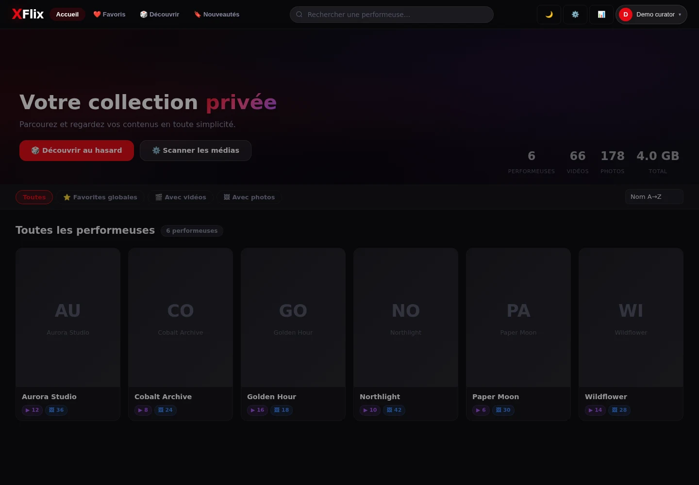
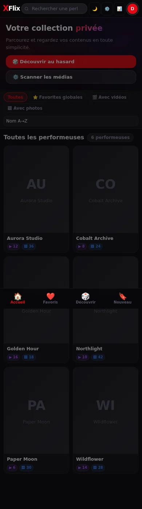

<h1 align="center">
  🎬 XFlix
</h1>

<p align="center">
  <strong>Self-hosted media browser</strong> for local video & photo collections<br>
  <sub>Node.js · Express · MariaDB · Vanilla JS — zero build step</sub>
</p>

<p align="center">
  
  
  
</p>

---

## ⚡ Quick Start

Read the [installer contract](scripts/INSTALLATION.md) before installing or
upgrading. This is a major change from the former all-in-one installer:
preinstall root-controlled Node LTS **22.x >=22.16.0** or **24.x >=24.0.0** (prefer **24.x**),
compatible npm **10.x/11.x/12.x**, FFmpeg/ffprobe and a
running local MariaDB with its client/dump tools, plus systemd and the other
listed prerequisites. The installer does not install system packages or nvm.
It prefers a complete Node/npm distribution at the fixed real directory
`/usr/local/lib/xflix-node` (recommended Node **24.20.0**), otherwise `/usr/bin`.
This isolated runtime does not replace the host toolchain; arbitrary runtime
path overrides are refused. Rollback retains the Node path saved in the old unit.
Node 20 is EOL and refused by the production installer. The retained
`package.json` engine floor `>=20.9` describes development compatibility only.
npm 12 additionally requires Node 22.22.2+ or 24.15.0+ within those LTS lines;
the validation image target is Node **24.20.0**.

```bash
git clone https://github.com/HeartBtz/Xflix
cd Xflix
```

After reviewing a quiescent, root-controlled checkout at `/opt/xflix`, an
authorized operator can run `bash /opt/xflix/install.sh` from a controlled root
session. It prepares immutable releases and a dedicated **non-root `xflix`
systemd service**. PM2 and manual production processes are not managed; migrate
them separately. Do not run the installer from a user-writable checkout.

After a successful install, open the configured URL (local default:
**http://localhost:3000**), sign in, then launch a scan from the admin panel.
Fresh installations generate a protected `.admin-creds` file for the operator;
existing credentials are preserved, not rotated. Do not print this file into
logs or issues. Registration only bootstraps an admin when the user table is
empty, not when an existing installation has lost its admins.

> **Updates:** review and validate the target revision, stop external writers,
> then follow the installer contract. There is no automatic schema rollback.
> Backup tar/dump presence alone does not establish recoverability.

---

## 📖 Table of Contents

- [Features](#-features)
- [Screenshots](#-screenshots)
- [Quick Start](#-quick-start)
- [Manual Install](#-manual-install)
- [Configuration](#-configuration)
- [Media Directory Layout](#-media-directory-layout)
- [Architecture](#-architecture)
- [How the Scanner Works](#-how-the-scanner-works)
- [Thumbnails](#-thumbnails)
- [API Reference](#-api-reference)
- [Admin Panel](#-admin-panel)
- [Keyboard Shortcuts](#-keyboard-shortcuts)
- [Troubleshooting](#-troubleshooting)
- [Code audit](AUDIT.md)
- [Security](SECURITY.md)
- [Maintenance recovery](docs/MAINTENANCE-RECOVERY.md)
- [Validation](docs/VALIDATION.md)
- [Contributing](#-contributing)
- [License](#-license)

---

## ✨ Features

### 🎥 Browsing & Playback

- Browse **performers** — each subdirectory = one performer
- **Video streaming** with HTTP Range (instant seek, pause/resume)
- **Photo lightbox** with full-screen view and keyboard navigation
- **Discover** page with random videos & photos
- Global **search** with advanced filters (size, duration, type, favourite…)
- **Fully responsive** — phone, tablet, desktop, ultra-wide
- **Mobile bottom navigation** on small screens
- **Distraction-free fullscreen** — UI elements auto-hidden

### 👤 Accounts & Social

- **Register / Login** via signed, `HttpOnly` session cookies (12 hours by default)
- Roles: `admin` / `member`
- Per-media **comments** and **reactions** (like / dislike)
- **Personal favourites** per user + **global favourites** (admin)
- Password reset via email with hashed, one-hour, single-use tokens

### ⚙️ Admin Panel

- **Live scan** with SSE progress stream
- Auto-enrich **video durations** (ffprobe) + auto-generate **thumbnails**
- **Duplicate detection** (full-file SHA-256) + bounded, journaled removal
- **Cleanup**: preview missing DB rows and unindexed files; quarantine stale thumbnails
- **Purge short videos** under a configurable threshold
- **Media browser**: filter and delete by performer / type / filename
- **User management**: change roles, delete accounts
- **SMTP settings** editable at runtime (no restart needed)

---

## 🖼️ Screenshots

These screenshots are rendered from the real interface with synthetic API data.
They contain no personal media or production information:



<p align="center">
  
</p>

---

## 🔧 Manual Install

<details>
<summary>Click to expand step-by-step instructions</summary>

### 1. System dependencies

The production path is the [installer contract](scripts/INSTALLATION.md), not
this development example. Prefer Node 24 LTS; production admits Node 22.x
>=22.16.0 or 24.x >=24.0.0 with a compatible npm 10/11/12 as detailed above.
Provision the toolchain, MariaDB and FFmpeg/ffprobe separately. Use a disposable database and media directory for
development; do not point a local checkout at production state.

### 2. Database

```bash
sudo mariadb -u root << 'SQL'
CREATE DATABASE IF NOT EXISTS xflix CHARACTER SET utf8mb4 COLLATE utf8mb4_unicode_ci;
CREATE USER IF NOT EXISTS 'xflix'@'localhost' IDENTIFIED BY 'CHANGE_ME';
GRANT SELECT, INSERT, UPDATE, DELETE, CREATE, ALTER, INDEX, REFERENCES, DROP ON xflix.* TO 'xflix'@'localhost';
FLUSH PRIVILEGES;
SQL
```

### 3. Verify the development toolchain

```bash
node --version
npm --version
ffmpeg -version
ffprobe -version
```

For production, node/npm must be system-installed and root-controlled as
specified in the contract. A root-home nvm installation is not supported.

### 4. Clone & configure

```bash
git clone https://github.com/HeartBtz/Xflix
cd Xflix
npm ci --ignore-scripts --include=optional
cp .env.example .env
nano .env              # set MEDIA_DIR, DB_PASS, JWT_SECRET
```

### 5. Run

```bash
# Development only, as an unprivileged user
node server.js
```

Do not copy a generic unit or use PM2 as the standard production setup. The
installer generates a release-specific, sandboxed systemd unit.

### 6. Scan your media

```bash
node cli.js scan
# Or from the web UI: Admin → Scan
```

</details>

---

## ⚙️ Configuration

For development, copy `.env.example` to `.env` and set the media path, database
credentials and a strong `JWT_SECRET`. For installer-managed deployments,
`/etc/xflix/.env` is authoritative after the first import. The old source `.env`
is retained but subsequent edits to it do not configure the service. Changes to
the authoritative environment require a reviewed install/release, not merely a
restart. See [installation](scripts/INSTALLATION.md) for accepted syntax.

| Variable | Default | Description |
|---|---|---|
| `PORT` | `3000` | HTTP listen port |
| `REQUIRE_AUTH` | `true` | Protect API, thumbnails, streams, photos and downloads |
| `TRUST_PROXY` | `loopback` | Express trusted proxy policy |
| `COOKIE_SECURE` | *(auto)* | Override the session cookie `Secure` attribute |
| `MEDIA_DIR` | — | **Required.** Absolute path to your media root |
| `THUMB_DIR` | `data/thumbs` | Thumbnail storage directory |
| `XFLIX_MEDIA_WRITE` | `false` | Exact `true` opts into media writes and quarantine journals; installer sandbox must also allow writes |
| `XFLIX_ALLOW_MISSING_CLEANUP` | disabled | Exact `true` permits missing-row cleanup only with a verified storage sentinel |
| `XFLIX_STORAGE_SENTINEL` | unset | Sentinel file path inside `MEDIA_DIR` for storage identity checks |
| `XFLIX_STORAGE_SENTINEL_VALUE` | unset | Expected trimmed sentinel contents; required with the sentinel path |
| `DB_HOST` | `localhost` | MariaDB host |
| `DB_PORT` | `3306` | MariaDB port |
| `DB_USER` | `xflix` | MariaDB user |
| `DB_PASS` | — | MariaDB password |
| `DB_NAME` | `xflix` | Database name |
| `JWT_SECRET` | unset | Required strong signing key in production; fresh installer generates one |
| `JWT_EXPIRES` | `12h` | Session validity (`1h`, `7d`, etc.) |
| `BASE_URL` | — | Public URL used in password-reset emails |
| `CORS_ORIGIN` | *(same-origin)* | Optional comma-separated CORS allow-list |
| `SMTP_ALLOW_SELF_SIGNED` | `false` | Disable SMTP certificate verification (private lab only) |

> 💡 SMTP can also be configured at runtime from **Admin → Settings**.

The installer fixes `THUMB_DIR=/opt/xflix/data/thumbs`. Media stays read-only by
default; reads, scans, DB updates and thumbnail generation remain available.
Media removal requires `XFLIX_MEDIA_WRITE=true` even with `deleteFile:false`,
because its journal lives under `MEDIA_DIR/.xflix-trash`. This does not grant
filesystem permissions. See [maintenance recovery](docs/MAINTENANCE-RECOVERY.md)
before enabling mutations or missing-file cleanup.

### Internet-facing deployment

Keep `REQUIRE_AUTH=true`, set `BASE_URL` to the external HTTPS URL and place
XFlix behind a TLS reverse proxy. `TRUST_PROXY` must describe only that proxy;
do not use an unrestricted value. Leave `CORS_ORIGIN` empty for the normal
same-origin web UI. Registration defaults to closed once any user exists unless
explicitly reopened. An existing user table without an admin requires operator
recovery; public registration cannot take it over.

Security headers disallow framing, third-party scripts and inline JavaScript.
Session tokens are stored in a host-only `HttpOnly; SameSite=Strict` cookie and
checked against the user's database `session_version` on authenticated requests.
All legacy sessions without the `sv` claim are invalidated, not migrated.
Logout revokes all current sessions for that account; password change/reset and
role changes also advance the version. New passwords require at least 12
characters and at most 72 UTF-8 bytes, with bcrypt cost 12. Legacy login still
accepts passwords up to 128 characters. See
[`SECURITY.md`](SECURITY.md) for the audit, remaining risks and deployment
checklist.

---

## 📁 Media Directory Layout

XFlix expects a flat two-level structure:

```
MEDIA_DIR/
├── PerformerName/
│   ├── video1.mp4
│   ├── photo1.jpg
│   └── subfolder/
│       └── video2.mkv
└── AnotherPerformer/
    └── …
```

- Each **immediate subdirectory** of `MEDIA_DIR` → one performer
- Media can be **nested at any depth** inside performer directories
- **Video**: `.mp4` `.mkv` `.avi` `.mov` `.webm` `.wmv` `.flv` `.m4v` `.ts` `.3gp`
- **Photo**: `.jpg` `.jpeg` `.png` `.gif` `.webp` `.bmp` `.heic` `.heif` `.avif`

---

## 🏗️ Architecture

```
Browser (Vanilla JS SPA)
    │  REST + SSE  │  Range streaming
    ▼              ▼
┌────────────────────────────────────────────┐
│              Express (server.js)           │
│  /auth   /social   /admin   /api   /stream │
└──────────┬─────────────────────────────────┘
           │  mysql2/promise pool (20 connections)
           ▼
      MariaDB (xflix)
```

<details>
<summary>File map</summary>

```
xflix/
├── server.js           Express entry point, middleware, routes
├── db.js               DB pool, schema migrations, all query helpers
├── scanner.js          File walker, batch insert, thumbnail generation
├── cli.js              CLI: node cli.js scan | clear --confirm
├── install.sh          Reviewed release/systemd installer (see scripts/INSTALLATION.md)
│
├── routes/
│   ├── api.js          Public REST API (performers, media, search, stats)
│   ├── auth.js         Register, login, JWT, password reset
│   ├── social.js       Comments, reactions, per-user favourites
│   ├── admin.js        Scan, users, settings, duplicates, cleanup
│   └── stream.js       Video streaming, photos, thumbnails, downloads
│
├── middleware/
│   └── auth.js         JWT: optionalAuth → requireAuth → requireAdmin
│
├── services/
│   └── mail.js         Nodemailer (password reset emails)
│
├── public/             Static frontend (served by Express)
│   ├── index.html      SPA shell
│   ├── admin.html      Admin panel
│   ├── css/            Stylesheets
│   └── js/
│       ├── app.js      SPA logic (~2000 lines, no framework)
│       └── admin.js    Admin panel logic
│
├── data/thumbs/        Generated thumbnails (git-ignored)
├── .env.example        Configuration template
└── package.json
```

</details>

Post-index phases within the same maintenance job/lock:

| Job | Tool | Concurrency |
|---|---|---|
| `enrichDurations()` | ffprobe | 3 |
| `generateMissingThumbs()` | ffmpeg / sharp | 3 |

---

## 🔍 How the Scanner Works

```
Admin → Scan
   │
   ├─ 1. Read performer subdirectories from MEDIA_DIR
   ├─ 2. Load all existing file paths into memory (one query)
   ├─ 3. For each performer:
   │      a. Upsert performer row
   │      b. Async-walk directory tree (non-blocking generator)
   │      c. Skip already-indexed files (O(1) Set lookup)
   │      d. Batch insert new files (500 rows / query)
   │      e. Send SSE progress event after each batch
   ├─ 4. Update performer counts (videos, photos, size)
   └─ 5. Await enrichment + thumbnail generation before completion
```

Scans are **incremental**: already-indexed files are skipped. `runScan()` holds
the MariaDB maintenance lock through indexing, enrichment and thumbnails;
conflicting cooperating CLI/HTTP jobs receive a conflict instead of overlapping.
Cancellation stops new work and drains started workers, but does not undo
committed batches. Check `phase`, `completed`, `cancelled` and errors before
reporting success. This is not a persistent, restart-resumable queue.

---

## 🖼️ Thumbnails

Stored in `data/thumbs/` as `v_<id>.jpg` (video) or `p_<id>.jpg` (photo).

| Step | What happens |
|---|---|
| Request `GET /thumb/:id` | Check DB `thumb_path`; serve if present (1-hour private cache with auth enabled) |
| Not found | Generate: **sharp** (photos) or **ffmpeg at 10%** (videos) |
| Queue full | Return `503 Retry-After: 4` — frontend retries with backoff |
| After scan | Auto-generate for last 300 media items (concurrency 3) |

---

## 📡 API Reference

<details>
<summary>Click to expand full API documentation</summary>

REST endpoints return JSON; media routes return content and SSE routes stream
events. Errors include `{ "error": "..." }`; maintenance errors may also include
`operation_id`, `deleted: null`, `partial` and `recovery_required`.

### Performers

| Method | Path | Description |
|---|---|---|
| `GET` | `/api/performers` | List (query: `q`, `sort`, `order`, `favorite`, `limit`, `offset`) |
| `GET` | `/api/performers/:name` | Single performer by name |
| `POST` | `/api/performers/:id/favorite` | Toggle global favourite |

### Media

| Method | Path | Description |
|---|---|---|
| `GET` | `/api/performers/:name/videos` | Paginated videos |
| `GET` | `/api/performers/:name/photos` | Paginated photos |
| `GET` | `/api/media/:id` | Single record + performer name |
| `POST` | `/api/media/:id/favorite` | Toggle global favourite |
| `POST` | `/api/media/:id/view` | Increment view counter |

### Discovery

| Method | Path | Description |
|---|---|---|
| `GET` | `/api/search` | Search by filename and performer |
| `GET` | `/api/random/videos` | Random video sample |
| `GET` | `/api/random/photos` | Random photo sample |
| `GET` | `/api/random/performer` | Random performer |
| `GET` | `/api/recent` | Recently viewed |
| `GET` | `/api/popular` | Most viewed |
| `GET` | `/api/favorites` | Globally favourited media |
| `GET` | `/api/stats` | Aggregate dashboard stats |

### Streaming

| Method | Path | Description |
|---|---|---|
| `GET` | `/stream/:id` | Video stream (Range support) |
| `GET` | `/photo/:id` | Full-size photo |
| `GET` | `/thumb/:id` | Thumbnail (on-demand generation) |
| `GET` | `/download/:id` | Force-download |

### Authentication

| Method | Path | Auth | Description |
|---|---|---|---|
| `POST` | `/auth/register` | — | Create account |
| `POST` | `/auth/login` | — | Starts an HttpOnly session |
| `POST` | `/auth/logout` | current session if present | Revokes all account sessions and clears the cookie; retry on 503 |
| `GET` | `/auth/me` | ✔ | Current user profile |
| `PUT` | `/auth/profile` | ✔ | Update username / bio |
| `POST` | `/auth/change-password` | ✔ | Change password |
| `POST` | `/auth/forgot-password` | — | Send reset email |
| `POST` | `/auth/reset-password` | — | Consume reset token |
| `GET` | `/auth/config` | — | Registration status |

### Social

| Method | Path | Description |
|---|---|---|
| `GET` | `/social/comments/:mediaId` | Paginated comments |
| `POST` | `/social/comments/:mediaId` | Post comment (auth) |
| `PATCH` | `/social/comments/:id` | Edit own comment (auth) |
| `DELETE` | `/social/comments/:id` | Delete own comment (auth) |
| `GET/POST` | `/social/reactions/:mediaId` | Like/dislike counts & toggle |
| `GET/POST` | `/social/favorites/:mediaId` | Check / toggle personal favourite |
| `GET` | `/social/favorites` | User's personal favourites |

### Admin (requires `role=admin`)

| Method | Path | Notes |
|---|---|---|
| `GET` | `/admin/stats` | Dashboard counts |
| `*` | `/admin/users/*` | User management |
| `GET/PUT` | `/admin/settings` | App settings (SMTP…) |
| `POST` | `/admin/scan` | **SSE** — live scan |
| `POST` | `/admin/batch-thumbs` | **SSE** — batch thumbnails |
| `POST` | `/admin/duplicates/scan` | **SSE** — duplicate detection |
| `POST` | `/admin/clean-media` | **SSE** — orphan cleanup |
| `POST` | `/admin/purge-short-videos` | **SSE** — short video purge |
| `DELETE` | `/admin/media/:id`, `/admin/duplicates/:id` | JSON `deleteFile` boolean required; optional `dry_run` |
| `POST` | `/admin/duplicates/delete-bulk` | **SSE**; 1-500 distinct positive integer `ids`, JSON `deleteFile` boolean |

> **SSE endpoints** stream `data: {...}\n\n` events. Last event carries `status: "done"` or `status: "error"`.

An interrupted stream is not success. Progress marked `staged` is not a committed
deletion. Cleanup and short-video purge default to `dry_run:true`; explicit
single/bulk deletion does not. Booleans must be JSON booleans, not strings;
`delete_file` query parameters are rejected. A deletion dry run does not prove
that live storage, a surviving duplicate or permissions will pass at execution.
See the [recovery guide](docs/MAINTENANCE-RECOVERY.md) for ambiguous results.

</details>

---

## 🛠️ Admin Panel

Access via the ⚙️ icon (visible when logged in as admin).

| Tab | What it does |
|---|---|
| **Scan** | Index new media files — live SSE progress |
| **Thumbnails** | Generate thumbnails for media without one |
| **Duplicates** | Full-file SHA-256 detection; removal rechecks an independent surviving copy |
| **Cleanup** | Find orphaned DB records, unindexed files, stale thumbs |
| **Purge** | Delete videos shorter than a configurable duration |
| **Media** | Browse, search, delete individual records |
| **Users** | Manage accounts and roles |
| **Settings** | SMTP config, toggle open registration |

---

## ⌨️ Keyboard Shortcuts

| Key | Action |
|---|---|
| `←` / `→` | Previous / next in lightbox or player |
| `F` | Toggle favourite |
| `D` | Download current media |
| `Escape` | Close lightbox / player |
| `Space` | Play / pause video |

---

## 🔥 Troubleshooting

<details>
<summary><strong>Server won't start — "DB error"</strong></summary>

```bash
sudo systemctl status mariadb
mariadb -u xflix -p              # test credentials
journalctl -u xflix --lines 50   # if using systemd
```

</details>

<details>
<summary><strong>Password reset link goes to localhost</strong></summary>

For installer-managed services, set `BASE_URL=https://your-domain.com` in the
authoritative `/etc/xflix/.env`, then perform a reviewed install/release. Do not
append duplicate keys. For local development only, edit the checkout `.env`
and restart the development process.

</details>

<details>
<summary><strong>Video thumbnails are missing / black</strong></summary>

```bash
which ffmpeg && ffmpeg -version
sudo apt install ffmpeg
sudo systemctl restart xflix
```

</details>

<details>
<summary><strong>Photos have no thumbnails</strong></summary>

Check source/thumbnail directory access, image format support and the native
sharp smoke-test result. Do not rebuild dependencies inside an immutable
production release or run npm as root. The installer prepares dependencies and
tests sharp before service downtime; follow its reviewed release workflow if
dependency preparation failed.

</details>

<details>
<summary><strong>Scan is very slow</strong></summary>

60 000+ files can take 30–60 seconds — this is expected. The async walker is non-blocking.
Check logs for `[SCANNER ERROR]` messages.

</details>

<details>
<summary><strong>Fresh start (purge all data)</strong></summary>

This is destructive, not a repair for a failed scan or an ambiguous deletion.
For an explicitly disposable development database only:

```bash
node cli.js clear --confirm
node cli.js scan
```

`clear --confirm` transactionally deletes media, performers and tags with
foreign-key checks enabled. Related social rows cascade; users and settings
remain. It does not delete originals or thumbnails. Do not blanket-delete
thumbnail directories or quarantine journals. For production, stop other
writers and use a separately reviewed offline procedure with the installed
release's environment and tested backups.

</details>

---

## 🤝 Contributing

See [CONTRIBUTING.md](CONTRIBUTING.md) for local setup, conventions, validation,
and pull request guidance. `npm run check` includes unit and fixture tests; real
MariaDB integration is opt-in, and Playwright covers desktop and mobile UI flows.

`GET /health` returns the exact installed release as
`{"status":"ok","version":"MAJOR.MINOR.PATCH"}`. GitLab validates merge requests
and builds protected SemVer tags, but production deployment remains blocked
until a verified source-limited forced receiver replaces the disproven historical
direct-root path. See [the release contract](docs/RELEASE.md).

---

## 📋 Changelog

<details>
<summary>Version history</summary>

### v2.3 (current)

- History-aware video/photo overlays; browser back closes the viewer before its page
- Fullscreen/Picture-in-Picture cleanup and manual scroll restoration
- Private-by-default media routes with HttpOnly cookie sessions and CSRF origin checks
- Strict script CSP; all dynamic inline handlers removed
- Reset tokens hashed at rest; reset URLs and tokens are never logged
- Strict SMTP certificate validation and safer reverse-proxy/CORS defaults
- Native `ffmpeg`/`ffprobe` integration replaces the abandoned `fluent-ffmpeg` package
- Dependency refresh and automated navigation/security tests

### v2.2

- **Full responsive layout** for all screen sizes (ultra-wide → small phone)
- **Mobile bottom navigation** bar (< 768px)
- **Fullscreen player** cleanup — suggestions and comments auto-hidden
- **SPA history** — browser back/forward buttons work correctly
- **MEDIA_DIR** fix — dotenv now uses `__dirname`-relative paths (works with PM2/systemd)
- **Security**: XSS fix in comment editing, LIKE wildcard escaping, re-validate admin role from DB
- **systemd support** — `install.sh` now offers `xflix.service` as a startup option

### v2.1

- Rate limiter scoped to auth routes only (fixes "Too many requests" loop)
- Password reset URL auto-derived from request host
- SMTP overhaul: TLS compat, empty-auth handling, timeouts
- Admin SMTP password field no longer overwrites on blank save

### v2.0

- Admin UI redesigned (modern dark theme, frosted navbar)

### v1.2

- Auto-tagging on scan (resolution, codec, duration)
- Dark/light theme toggle
- Tag-based filtering, "Recently added" page, Discover section
- Related videos in player, custom thumbnail upload, infinite scroll
- Video technical info via ffprobe

</details>

---

## 📄 License

[MIT](LICENSE) — © HeartBtz
